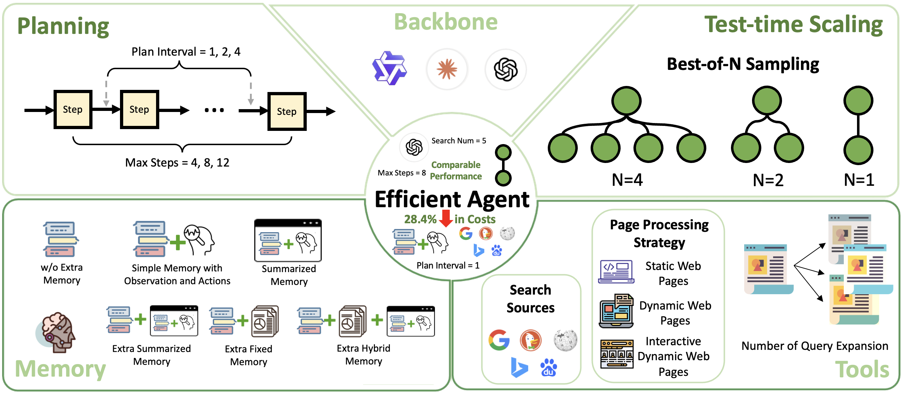

<div align="center">

<h2>Efficient Agents: Building Effective Agents While Reducing Cost, OPPO PersonalAI Lab.</h2>

</div>

<div align="center">

  <a href='https://arxiv.org/abs/2508.02694'></a>
  <a href='https://www.python.org/downloads/release/python-31210/'></a>
  <a href='https://github.com/Juvenilecris/Efficient-Agents/blob/main/LICENSE'></a>
  
</div>

This is the official repository for our papers "Efficient Agents: Building Effective Agents While Reducing Cost [[Paper]](https://arxiv.org/abs/2508.02694)"

<div align="center">
    
</div>

---

## News 📰

**[2025.08.06]** Released the initial codebase.

---

## Abstract 📚

The remarkable capabilities of Large Language Model (LLM)-driven agents have enabled sophisticated systems to tackle complex, multi-step tasks, but their escalating costs threaten scalability and accessibility. This work presents the first systematic study of the efficiency-effectiveness trade-off in modern agent systems, addressing the critical need for cost-effective designs without sacrificing performance. We investigate three key questions: (1) How much complexity do agentic tasks inherently require? (2) When do additional modules yield diminishing returns? (3) How much efficiency can be gained through the design of efficient agent frameworks? Through an empirical analysis on the GAIA benchmark, we evaluate the impact of LLM backbone selection, agent framework designs, and test-time scaling strategies. Using the cost-of-pass metric, we quantify the efficiency-performance trade-off across these dimensions. Our findings inform the development of Efficient Agents , a novel agent framework that has an optimal complexity to task requirements. Efficient Agents retains 96.7% of the performance of OWL, one leading open-source agent framework, while reducing operational costs from 0.398to0.228, resulting in a 28.4% improvement in cost-of-pass. Our work provides actionable insights for designing efficient, high-performing agent systems, advancing the accessibility and sustainability of AI-driven solutions.

---

## Setup 🔍

To get started, follow the steps below:

### Install dependencies

Run the following command to install the required dependencies from the `requirements.txt` file:

```bash
pip install -r ./example/oagents_deep_research/requirements.txt
```

### Install our development version of `smolagents`

```bash
pip install -e ./.[dev]
```

### Configuration `.env` File

We provide a template file named `.env_template` for your convenience. You can copy this file and rename it to `.env`, then fill in your actual API keys and service addresses. For example:

```bash
cp .env_template .env
```

Then edit the `.env` file with your credentials.


#### 🔍 Search and Crawling Services

The agent uses the following external services for web search and content crawling. Please configure the corresponding API keys:

- **Search Engine: SerpApi**  
  Used for performing web searches. Get your API key from [SerpApi](https://serpapi.com/)  and set it as:
  ```
  SERP_API_KEY=<your-serp-api-key>
  ```

- **Web Crawler: Jina AI Reader**  
  Used for accessing and parsing web content. Sign up at [Jina AI](https://jina.ai/)  to obtain an API key and set it as:
  ```
  JINA_API_KEY=<your-jina-api-key>
  ```

---

## Evaluation of OAgents on GAIA 📕

### Main Usage

#### Step 1: Prepare the Data
Download the GAIA dataset and place it under the following directory:
```
./example/oagents_deep_research/data/gaia
```
The expected directory structure is as follows:
```
├── data
│   ├── gaia
│       ├── test
│       └── validation
```
#### Step 2: Test run on GAIA
You're now all set to run on GAIA! First, go to main part of GAIA evaluation.
```bash
cd ./example/oagents_deep_research
```

Simply execute the run_gaia.py script, like so:
```bash
python run_gaia.py --model_id gpt-4.1 --model_id_search gpt-4.1 --run_name gpt-4.1-gaia
```
If you'd like to use different questions or datasets, you can refer to the run_gaia.py script for guidance and make the necessary adjustments.

### TTS usage
To simplify the agent exploration process in the TTS algorithm, we have removed the nested ToolCalling agent structure. Instead, the CodeAgent now directly interfaces with various tools, eliminating intermediate layers while maintaining full functionality. This architectural change reduces computational overhead and improves execution efficiency.

Different Sampling Strategies (use best setting)
```bash
python run_gaia_tts.py --model_id gpt-4.1 --model_id_search gpt-4.1 --run_name gpt-4.1-gaia_tts --max_steps 100 --search_type BON --n_rollouts 4 --verify_type list-wise --result_merging_type list-wise
```

Setting reflection_threshold for Reflection
```bash
python run_gaia_tts.py --model_id gpt-4.1 --model_id_search gpt-4.1 --run_name gpt-4.1-gaia_reflection --max_steps 100 --search_type default --reflection --reflection_threshold 2  
```

---

## Acknowledgement 📖

We would like to express our sincere gratitude to the original authors and contributors of **smolagents**, an excellent open-source project that provided a solid foundation for our work. Our implementation has been adapted from the official repository:

- [[smolagents]](https://github.com/huggingface/smolagents) 

Their thoughtful design and clear code structure greatly facilitated our exploration and experimentation.
  
## Citation 🚩
If you find this work useful, please consider citing our papers:

**Efficient Agents: Building Effective Agents While Reducing Cost**：

```bigquery
@misc{wang2025efficientagentsbuildingeffective,
      title={Efficient Agents: Building Effective Agents While Reducing Cost}, 
      author={Ningning Wang and Xavier Hu and Pai Liu and He Zhu and Yue Hou and Heyuan Huang and Shengyu Zhang and Jian Yang and Jiaheng Liu and Ge Zhang and Changwang Zhang and Jun Wang and Yuchen Eleanor Jiang and Wangchunshu Zhou},
      year={2025},
      eprint={2508.02694},
      archivePrefix={arXiv},
      primaryClass={cs.AI},
      url={https://arxiv.org/abs/2508.02694}, 
}
```

---

## Star ⭐

<div align="center">

[](https://github.com/Juvenilecris/Efficient-Agents)

</div>