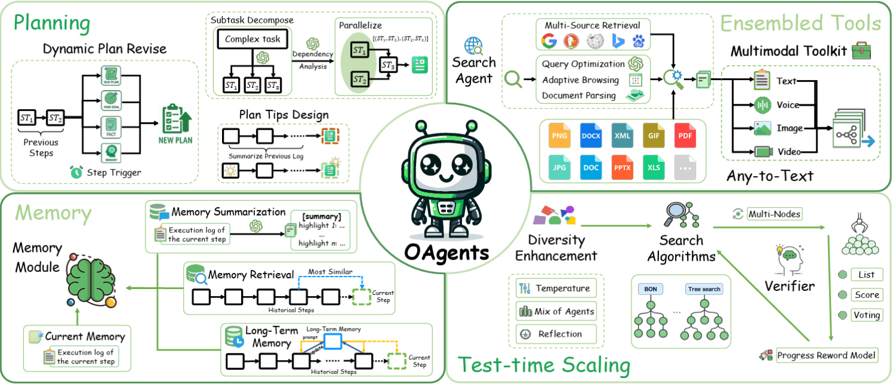

<div align="center">

<h2>An Empirical Study of Building Effective Agents, OPPO PersonalAI Lab.</h2>

</div>

<div align="center">

  <a href='https://arxiv.org/pdf/2506.15741'></a>
  <a href='https://arxiv.org/pdf/2506.12928'></a>
  <a href='https://arxiv.org/abs/2508.02694'></a>
  <a href='https://www.python.org/downloads/release/python-31210/'></a>
  <a href='https://github.com/OPPO-PersonalAI/OAgents/blob/main/LICENSE'></a>
  
</div>

This is the official repository for our papers 
- 🤖 **[OAgents](https://arxiv.org/abs/2506.15741): An Empirical Study of Building Effective Agents**
- 🚀 **[Scaling](https://arxiv.org/abs/2506.12928) Test-time Compute for LLM Agents**
- 💸 **[Efficient Agents](https://arxiv.org/abs/2508.02694): Building Effective Agents While Reducing Cost**

<div align="center">
    
</div>

---

## News 📰

**[2025.08.06]** Released the [efficient agents](https://github.com/OPPO-PersonalAI/OAgents/tree/main/Efficient_Agents) codebase.

**[2025.06.23]** Released the initial codebase.

---

## Introduction 📚

Agentic AI has gained significant attention, but current research lacks standardization, making fair comparisons difficult. In this work, we conduct a systematic study on key design choices in agent frameworks using the GAIA and BrowseComp benchmarks. We introduce a robust evaluation protocol to ensure reproducibility and identify crucial components for effective agents. Based on our findings, we develop and open-source OAgents, a modular foundation agent framework that achieves state-of-the-art performance among open-source projects, promoting future research in Agentic AI.

---

## Setup 🔍

To get started, follow the steps below:

### Install dependencies

Run the following command to install the required dependencies from the `requirements.txt` file:

```bash
pip install -r ./oagents/example/oagents_deep_research/requirements.txt
```

### Install `oagents`

```bash
cd oagents
pip install -e ./.[dev]
```

### Configuration `.env` File

We provide a template file named `.env_template` for your convenience. You can copy this file and rename it to `.env`, then fill in your actual API keys and service addresses. For example:

```bash
cp .env_template .env
```

Then edit the `.env` file with your credentials.


#### 🔍 Search and Crawling Services

The agent uses the following external services for web search and content crawling. Please configure the corresponding API keys:

- **Search Engine: SerpApi**  
  Used for performing web searches. Get your API key from [SerpApi](https://serpapi.com/)  and set it as:
  ```
  SERP_API_KEY=<your-serp-api-key>
  ```

- **Web Crawler: Jina AI Reader**  
  Used for accessing and parsing web content. Sign up at [Jina AI](https://jina.ai/)  to obtain an API key and set it as:
  ```
  JINA_API_KEY=<your-jina-api-key>
  ```

---

## Evaluation of OAgents on GAIA 📕

### Main Usage

#### Step 1: Prepare the Data
Download the GAIA dataset and place it under the following directory:
```
./oagents/example/oagents_deep_research/data/gaia
```
The expected directory structure is as follows:
```
├── data
│   ├── gaia
│       ├── test
│       └── validation
```
#### Step 2: Test run on GAIA
You're now all set to run on GAIA! First, go to main part of GAIA evaluation.
```bash
cd ./oagents/example/oagents_deep_research
```

Simply execute the run_gaia.py script, like so:
```bash
python run_gaia.py --model_id gpt-4.1 --model_id_search gpt-4.1 --run_name gpt-4.1-gaia
```
If you'd like to use different questions or datasets, you can refer to the run_gaia.py script for guidance and make the necessary adjustments.

### TTS usage
To simplify the agent exploration process in the TTS algorithm, we have removed the nested ToolCalling agent structure. Instead, the CodeAgent now directly interfaces with various tools, eliminating intermediate layers while maintaining full functionality. This architectural change reduces computational overhead and improves execution efficiency.

Different Sampling Strategies (use best setting)
```bash
python run_gaia_tts.py --model_id gpt-4.1 --model_id_search gpt-4.1 --run_name gpt-4.1-gaia_tts --max_steps 100 --search_type BON --n_rollouts 4 --verify_type list-wise --result_merging_type list-wise
```

Setting reflection_threshold for Reflection
```bash
python run_gaia_tts.py --model_id gpt-4.1 --model_id_search gpt-4.1 --run_name gpt-4.1-gaia_reflection --max_steps 100 --search_type default --reflection --reflection_threshold 2  
```

---

## Acknowledgement 📖

We would like to express our sincere gratitude to the original authors and contributors of **smolagents**, an excellent open-source project that provided a solid foundation for our work. Our implementation has been adapted from the official repository:

- [[smolagents]](https://github.com/huggingface/smolagents) 

Their thoughtful design and clear code structure greatly facilitated our exploration and experimentation.

### Modifications for OAgents 🧪

In the context of our framework **OAgents**, we have made several modifications to the original implementation, including but not limited to:

- 🔄 **Architecture adjustments**: We restructured key components such as the memory module and planning system to better align with our experimental goals. Specifically, we implemented and evaluated multiple memory architectures (e.g., short-term memory, long-term memory, and etc.) and tested various agent workflows to assess their impact on task performance and learning efficiency.
- 🛠️ **Tools optimization**: We enhanced the agent’s toolset by refining the search agent and introducing improved search and data processing capabilities. These updates aim to significantly boost the agent's ability to acquire, interpret, and utilize external knowledge during task execution.
- ⏱️ **Test-time scaling strategies**: To further reduce inference errors and improve robustness, we incorporated test-time scaling techniques, such as repeated reasoning, majority voting, and consistency filtering. These methods were used to refine decision-making during deployment and enhance overall reliability.

These changes were made with the goal of conducting a more rigorous and reproducible empirical analysis of agent-based learning systems. We acknowledge the importance of building upon existing work and hope that our contributions can further enrich the community's understanding of agent framework.

---
  
## Citation 🚩
If you find this work useful, please consider citing our papers:

**OAgents: An Empirical Study of Building Effective Agents**：

```bigquery
@misc{zhu2025oagentsempiricalstudybuilding,
      title={OAgents: An Empirical Study of Building Effective Agents}, 
      author={He Zhu and Tianrui Qin and King Zhu and Heyuan Huang and Yeyi Guan and Jinxiang Xia and Yi Yao and Hanhao Li and Ningning Wang and Pai Liu and Tianhao Peng and Xin Gui and Xiaowan Li and Yuhui Liu and Yuchen Eleanor Jiang and Jun Wang and Changwang Zhang and Xiangru Tang and Ge Zhang and Jian Yang and Minghao Liu and Xitong Gao and Wangchunshu Zhou and Jiaheng Liu},
      year={2025},
      eprint={2506.15741},
      archivePrefix={arXiv},
      primaryClass={cs.AI},
      url={https://arxiv.org/abs/2506.15741}, 
}
```

**Scaling Test-time Compute for LLM Agents**：

```bigquery
@misc{zhu2025scalingtesttimecomputellm,
      title={Scaling Test-time Compute for LLM Agents}, 
      author={King Zhu and Hanhao Li and Siwei Wu and Tianshun Xing and Dehua Ma and Xiangru Tang and Minghao Liu and Jian Yang and Jiaheng Liu and Yuchen Eleanor Jiang and Changwang Zhang and Chenghua Lin and Jun Wang and Ge Zhang and Wangchunshu Zhou},
      year={2025},
      eprint={2506.12928},
      archivePrefix={arXiv},
      primaryClass={cs.AI},
      url={https://arxiv.org/abs/2506.12928}, 
}
```

**Efficient Agents: Building Effective Agents While Reducing Cost**：

```bigquery
@misc{wang2025efficientagentsbuildingeffective,
      title={Efficient Agents: Building Effective Agents While Reducing Cost}, 
      author={Ningning Wang and Xavier Hu and Pai Liu and He Zhu and Yue Hou and Heyuan Huang and Shengyu Zhang and Jian Yang and Jiaheng Liu and Ge Zhang and Changwang Zhang and Jun Wang and Yuchen Eleanor Jiang and Wangchunshu Zhou},
      year={2025},
      eprint={2508.02694},
      archivePrefix={arXiv},
      primaryClass={cs.AI},
      url={https://arxiv.org/abs/2508.02694}, 
}
```

---

## Star ⭐

<div align="center">

[](https://github.com/OPPO-PersonalAI/OAgents)

</div>


## We are hiring!🔥

If you are interested in career opportunities with the OPPO AI Agent Team, please feel free to send an email to: **personalab_recruit@oppo.com**. There are headcounts available for both **internships** and **full-time** positions.

